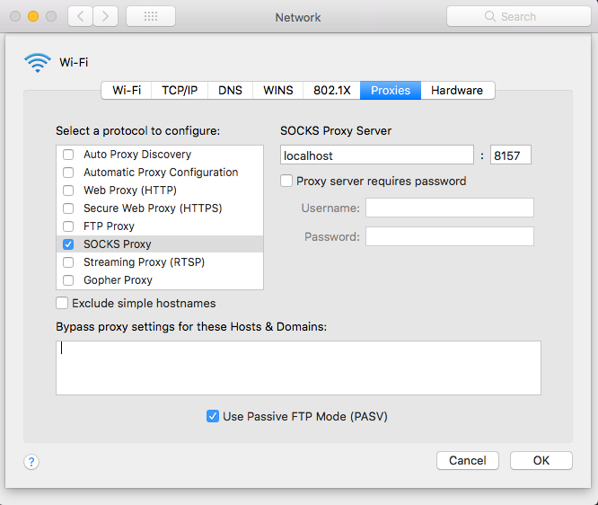
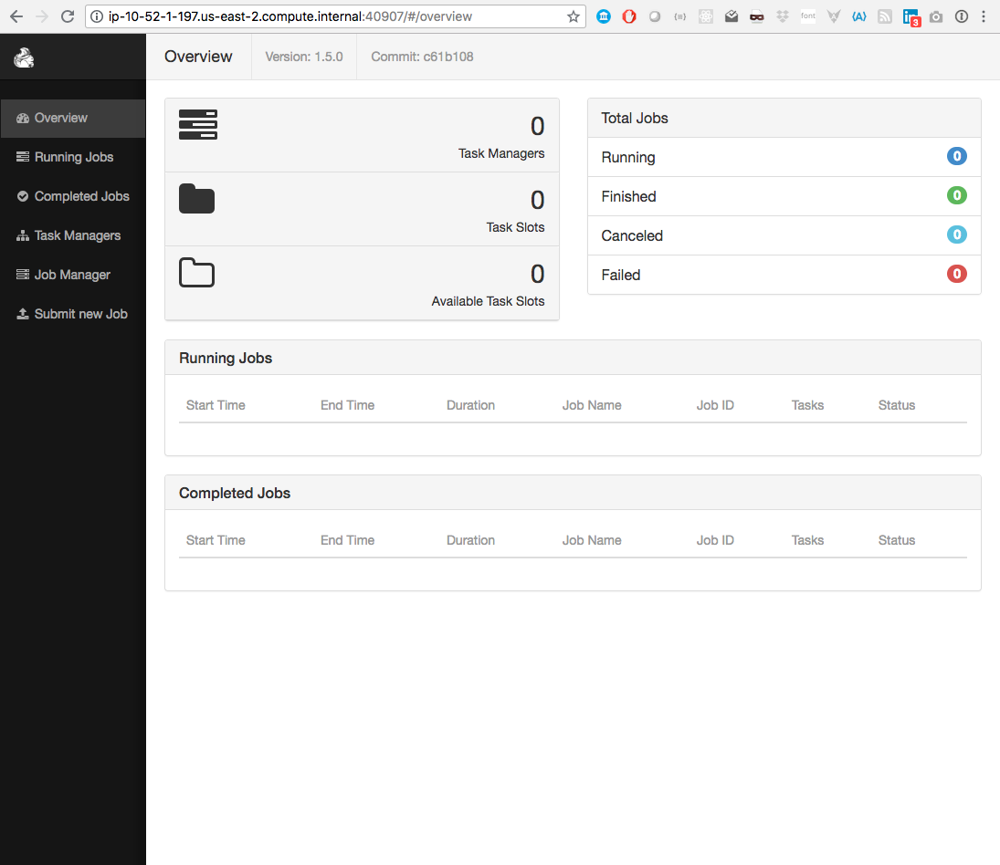

# emr-ctl

Epiphanous' `emr-ctl` is a swiss-army knife command line utility
that can be used to manage flink clusters running jobs written with
[epiphanous' `flinkrunner`](https://github.com/epiphanous/flinkrunner).
`emr-ctl` leverages AWS' [Elastic Map
Reduce](https://aws.amazon.com/emr/) (EMR) service to make deployment of
flink jobs reliable, scalable and easy to manage, in staging and
production.

Let's say you've used `flinkrunner` and build a system of flink jobs
called `flinkydink`. You can use `emr-ctl` to deploy the various
flink jobs in `flinkydink` to EMR and manage the clusters created there,
all from the comfort of your development environment.

In fact, the `emr-ctl` script can be run either locally in your laptop
development environment, or on the master node of a running EMR cluster. The
script has commands that work in both environments, as well as particular
commands supported only in each environment. In our examples,
we use the `dev>` prompt to indicate running locally on your own laptop, and
the `emr>` prompt to indicate running on the master node of an EMR cluster.

You can see a usage message by running the `emr-ctl` script without
arguments (or with the argument `help`)

```bash
dev> ./emr-ctl
```

The result is

![doc/images/help-screen.png]

> Notice there is a warning emitted about a missing `AWS_PROFILE` environment
> variable. This is only visible if you're in `dev` mode. `emr-ctl` relies
> on the [AWS command line interface](https://aws.amazon.com/cli/) to interact
> with the your EMR clusters. When running the script from your
> laptop you should make sure your AWS credentials file contains proper
> credentials to interact with your AWS resources, and if you have
> multiple profiles in your credentials file, be sure to select the appropriate
> one using the [`AWS_PROFILE` environment
> variable](https://docs.aws.amazon.com/cli/latest/userguide/cli-environment.html).

Most commands can be run either in local dev mode or on the EMR cluster. When
running in local dev mode, most commands require a `cluster id`.

#### S3

`emr-ctl` relies on s3 to store information that needs to be shared
with running EMR clusters. This includes the script itself, your `flinkrunner`
application JAR file, environment defaults, job configuration files and other
files used to provision EMR clusters.

The s3 bucket `emr-ctl` writes to should be configured in `emr-ctl`'s `.env`
config file to whatever is appropriate for your AWS setup. If you want to
keep your `emr-ctl` artifacts in a bucket called `com.example.emr-ctl.artifacts`,
then you'd set `S3_BUCKET=s3://com.example.emr-ctl.artifacts` in the `.env` file.
Obviously this needs to be a bucket you have access to. We'll discuss configuration
of other settings later.

#### List Existing Clusters

The normal sequence of operations is to first see what clusters are running
with `list-clusters`.

```bash
dev> ./emr-ctl list-clusters
```

```
id               name            state                   created           destroyed
j-H1YWYWM3OAF2   flinkydink-sta  WAITING                 02/12/2019 07:07  -
j-2TTQNFV1DM0WT  flinkydink-sta  TERMINATED              01/24/2019 06:14  01/24/2019 07:07
j-PXGUA758BTJU   flinkydink-sta  TERMINATED              01/21/2019 21:22  01/22/2019 06:08
j-N24TSJ7LXEHZ   flinkydink-sta  TERMINATED              01/21/2019 18:46  01/20/2019 21:19
j-1JIFNZPURVXZ6  flinkydink-sta  TERMINATED_WITH_ERRORS  01/20/2019 18:36  01/20/2019 18:39
j-201214UKBI0O4  My cluster      TERMINATED              01/19/2019 11:18  01/20/2019 05:29
j-37VE4KY6O32LG  flink Staging   TERMINATED              01/18/2019 23:03  01/19/2019 05:30
j-31YSVSJBFHX9K  flink Staging   TERMINATED              01/18/2019 21:02  01/18/2019 22:59
```

This output shows one active cluster and several terminated clusters.

You can interact with clusters in a state of `WAITING` or `RUNNING`. Clusters in the state
`TERMINATED` are inaccessible. If you only want to see active clusters, you can grep the
output like this:

```bash
dev> ./emr-ctl list-clusters | grep -v TERMINAT
```

which removes `TERMINATING`, `TERMINATED`, or `TERMINATED_WITH_ERRORS`
clusters from the list.

#### Creating a New Cluster

If you want to create a new cluster, use the `start-cluster` command.

```bash
dev> ./emr-ctl start-cluster staging '{}'
```

This command starts a new cluster in the staging environment.

> The environment name is configured by you to map to a particular
> AWS VPC subnet, so you can isolate your EMR jobs appropriately.

The second argument to `start-cluster` is a list of key/value pairs in
JSON format that will be merged with the default configuration for the
requested environment and
attached to the cluster. The key value pairs are called _tags_ because we
store them in the `tags metadata` of an EMR cluster to use for runtime
configuration of flink jobs. More on tags in a minute. But first, the
`start-cluster` command returns a cluster id:

```json
{
  "ClusterId": "j-H1YWYWM3OAF2"
}
```

You'll use this cluster id to interact with this cluster throughout
`emr-ctl`.

It takes a few minutes for a new cluster to be provisioned. You can run
`list-clusters` to check on its status. It will begin in `STARTING` state when
the master node is being provisioned, then move to `RUNNING` state when the
master node is ready and the task nodes are being provisioned, then finally to
`WAITING` state when the cluster is ready to start doing work.

#### Cluster Tags

The default tags for an environment are also managed via `emr-ctl`.
To list the current default tags for an environment, run this command:

```bash
dev> ./emr-ctl list-tags staging
```

```
ENV                staging
SUBNET             03cb8078
CLUSTER_NAME       flinkydink-${ENV}
CASSANDRA_HOST     10.23.17.204
FLINK_VERSION      1.7.2
FLINK_TARBALL      ${S3_BASE}/provision/flink-${FLINK_VERSION}/flink-${FLINK_VERSION}-bin-hadoop28-scala_2.11.tgz
INSTANCE_COUNT     3
INSTANCE_TYPE      m5.2xlarge
KAFKA_BROKER       10.23.17.124:9092
LOG_URI            ${S3_BASE}/logs/${ENV}
CHECKPOINT_BASE    ${S3_BASE}/flink-state/${ENV}
SAVEPOINT_BASE     ${S3_BASE}/flink-savepoints/${ENV}
S3_BASE            s3://com.example.emr-ctl-artifacts
PARALLELISM        1
RELEASE_LABEL      emr-5.21.0
flinkYDINK_VERSION 2.1.17
```

Tags are basically environment variables that allows flexible configuration of
job runs on clusters. You can set up whatever default tags you want for jobs to configure
them. When you start a new cluster in a particular environment,
`emr-ctl` merges the default tags for that cluster that it finds on s3 with
the additional tags you supply to the `start-cluster` command. These merged
tags are then stored in the cluster's metadata to be used to configure running
jobs on the cluster. This avoids the need to run additional infrastructure
like `consul` to manage configuration.

> **Job Configuration**: Cluster tags are interpolated into job-specific
> configuration files that `emr-ctl` manages on s3. These configuration
> files are stored in the `emr-ctl` artifacts repository under the `jobs`
> directory. Each supported environment has a subdirectory with JSON files, one
> per job. Each job file contains the arguments that should be supplied when
> running that job on flink. The files can reference any cluster tags like
> environment variables. There is a special JSON file called `defaults.json` for
> each environment that defines its default cluster tags.

You can use the `list-tags` command with a cluster id to see the tags actually
configured for a running cluster:

```bash
dev> ./emr-ctl list-tags j-H1YWYWM3OAF2
```

```
CLUSTER_NAME       flinkydink-staging
ENV                staging
JDBC_USERNAME      frodomadeit
JDBC_PASSWORD      ********************
LOG_URI            s3://com.example.emr-ctl.artifacts/logs/flinkydink-staging
JDBC_URL           postgresql://flinkyab2347878dsfs.cpodsoduzv.us-east-1.rds.amazonaws.com:5432/flinkydink
KAFKA_BROKER       10.23.17.126:9092
SUBNET             03dc803d
PARALLELISM        1
FLINK_TARBALL      s3://com.example.emr-ctl.artifacts/provision/flink-1.7.2/flink-1.7.2-bin-hadoop28-scala_2.11.tgz
CASSANDRA_HOST     10.23.17.204
flinkYDINK_VERSION 2.1.17
FLINK_VERSION      1.7.2
INSTANCE_COUNT     3
INSTANCE_TYPE      m5.2xlarge
RELEASE_LABEL      emr-5.21.0
SAVEPOINT_BASE     s3://com.example.emr-ctl.artifacts/flink-savepoints/staging
CHECKPOINT_BASE    s3://com.example.emr-ctl.artifacts/flink-state/staging
```

You can also publish the defaults, together with other job configuration
json files to s3 with the `publish-job-configs` command:

```bash
dev> ./emr-ctl publish-job-configs
```

This command synchronizes the `jobs` directory in the repo with its
corresponding directory on s3.

#### Terminating a Cluster

You can shut a cluster down with the `stop-cluster` command.

```bash
dev> ./emr-ctl stop-cluster j-2TTQNFV1DM0WT
```

```
An error occurred (ValidationException) when calling the TerminateJobFlows operation: Could not shut down one or more job flows since they are termination protected.
[failure]
```

This error is expected because
clusters are automatically created with _termination protection_, which
prevents them from being accidentally shut down. In order to intentionally shut a cluster down,
you must turn off termination protection.

```bash
dev> emr-ctl disable-tp <cluster-id>
```

You can read more about termination
protection in the [AWS EMR management
guide](https://docs.aws.amazon.com/emr/latest/ManagementGuide/UsingEMR_TerminationProtection.html#ProtectinganExistingJobFlow).

Once termination protection is disabled, you can run the `stop-cluster` command, which will immediately
return

```
Terminated
```

It actually takes a minute or two for the cluster resources to be de-provisioned. `list-clusters` will
show the state of the cluster as `TERMINATING` and then `TERMINATED` with a `destroyed` timestamp.

```
id               name            state                   created           destroyed
j-2TTQNFV1DM0WT  flinkydink-staging  TERMINATED              06/20/2018 06:14  06/20/2018 07:07
```

> NOTE: It's normal to shut down clusters. While they can remain running for long periods of time if
> desired, they are easy to reproduce, and committed offset consumers and flink checkpoint and savepoints
> make it possible to shut down
> clusters without losing data. They are meant to be started up and shut down as needed to accomplish
> company goals.

#### Bootstrap a New Cluster

Once a cluster has been started, it needs to be bootstrapped to work with your `flinkrunner` application jar.
You accomplish this with the `bootstrap` command.

```bash
dev> ./emr-ctl start-cluster staging '{}'
{
    "ClusterId": "j-394OWCGLKHED3"
}
dev> ./emr-ctl bootstrap j-394OWCGLKHED3
Warning: Permanently added 'ec2-47-87-17-126.us-east-1.compute.amazonaws.com,32.17.126.23' (ECDSA) to the list of known hosts.
download: s3://<your-s3-bucket>/emr-ctl to ./emr-ctl
download: s3://<your-s3-bucket>/provision/flink-1.7.2/flink-1.7.2-bin-hadoop28-scala_2.11.tgz to ../../tmp/flink.tgz
download: s3://<your-s3-bucket>/provision/flink-1.7.2/bin-config.sh to bin/config.sh
download: s3://<your-s3-bucket>/provision/flink-1.7.2/flink-conf.yaml to conf/flink-conf.yaml
flink-1.7.2 installed
download: s3://<your-s3-bucket>/jars/flinkydink-2.1.17.jar to ./flinkydink-2.1.17.jar
Connection to ec2-47-87-17-126.us-east-1.compute.amazonaws.com closed.
```

As can be seen from the output, the `bootstrap` command does three things:

- installs `emr-ctl` on the cluster master node
- if needed, upgrades flink on the master to the version denoted by the cluster tag `FLINK_VERSION`
  (so you're not stuck with whatever version of flink is current in the AWS EMR package you're using)
- installs your `flinkrunner` application jar

You are now ready to run `flinkydink` (or whatever less cool name you choose for you `flinkrunner` application)
jobs on the cluster. Before discussing running jobs, we take a look at running
`emr-ctl` on EMR vs. locally.

#### Running `emr-ctl` on EMR

At this point, you can ssh into the master node to run `emr-ctl` commands, if you like. While
you can do everything remotely from your dev environment, there are times when you want to get
closer to the action, perhaps to look at a process listing, or verify something in logs you can only access
in EMR. To access the cluster master node, you run

```bash
dev> ./emr-ctl ssh j-394OWCGLKHED3
ssh -o StrictHostKeyChecking=no -o ServerAliveInterval=10 -i ~/.ssh/staging hadoop@ec2-47-87-17-126.us-east-1.compute.amazonaws.com -t
Last login: Wed Jun 20 14:36:35 2018

       __|  __|_  )
       _|  (     /   Amazon Linux AMI
      ___|\___|___|

https://aws.amazon.com/amazon-linux-ami/2018.03-release-notes/
9 package(s) needed for security, out of 14 available
Run "sudo yum update" to apply all updates.

EEEEEEEEEEEEEEEEEEEE MMMMMMMM           MMMMMMMM RRRRRRRRRRRRRRR
E::::::::::::::::::E M:::::::M         M:::::::M R::::::::::::::R
EE:::::EEEEEEEEE:::E M::::::::M       M::::::::M R:::::RRRRRR:::::R
  E::::E       EEEEE M:::::::::M     M:::::::::M RR::::R      R::::R
  E::::E             M::::::M:::M   M:::M::::::M   R:::R      R::::R
  E:::::EEEEEEEEEE   M:::::M M:::M M:::M M:::::M   R:::RRRRRR:::::R
  E::::::::::::::E   M:::::M  M:::M:::M  M:::::M   R:::::::::::RR
  E:::::EEEEEEEEEE   M:::::M   M:::::M   M:::::M   R:::RRRRRR::::R
  E::::E             M:::::M    M:::M    M:::::M   R:::R      R::::R
  E::::E       EEEEE M:::::M     MMM     M:::::M   R:::R      R::::R
EE:::::EEEEEEEE::::E M:::::M             M:::::M   R:::R      R::::R
E::::::::::::::::::E M:::::M             M:::::M RR::::R      R::::R
EEEEEEEEEEEEEEEEEEEE MMMMMMM             MMMMMMM RRRRRRR      RRRRRR

[hadoop@ip-10-26-1-56 ~]$ ls
flinkydink-2.1.17.jar  emr-ctl
```

> IMPORTANT: `emr-ctl` assumes you have the proper environment ssh key
> pairs stored in your `~/.ssh` directory. That is, to access the staging
> environment, you need the `~/.ssh/staging` private key.

You can run `emr-ctl` commands here that are intended to be run on the EMR
master. If you try to run one that isn't meant for the EMR master, you'll get
a message like this:

```bash
emr> ./emr-ctl publish-jar
```

```
publish-jar can't be run inside an emr cluster
[failure]
```

Most commands that you can run inside an EMR cluster can be run from a dev environment
by simply passing the cluster id as an argument of the command.

#### Running Jobs

EMR clusters use [Hadoop YARN](https://hadoop.apache.org/docs/current/hadoop-yarn/hadoop-yarn-site/YARN.html)
to run jobs. This means to run a job you need to start a YARN application. If a YARN application isn't
running on the cluster when you start a job, `emr-ctl` will attempt to start a YARN application.
This means you shouldn't have to mess with YARN. But if things get weird, you can stop yarn or restart it
like this:

```bash
emr> ./emr-ctl start-yarn
```

```
18/06/20 14:48:43 INFO client.RMProxy: Connecting to ResourceManager at ip-10-52-1-36.us-east-1.compute.internal/10.23.1.147:8032
Using the result of 'hadoop classpath' to augment the Hadoop classpath: /etc/hadoop/conf:/usr/lib/hadoop/lib/*:/usr/lib/hadoop/.//*:/usr/lib/hadoop-hdfs/./:/usr/lib/hadoop-hdfs/lib/*:/usr/lib/hadoop-hdfs/.//*:/usr/lib/hadoop-yarn/lib/*:/usr/lib/hadoop-yarn/.//*:/usr/lib/hadoop-mapreduce/lib/*:/usr/lib/hadoop-mapreduce/.//*::/usr/lib/hadoop-lzo/lib/*:/usr/share/aws/aws-java-sdk/*:/usr/share/aws/emr/emrfs/conf:/usr/share/aws/emr/emrfs/lib/*:/usr/share/aws/emr/emrfs/auxlib/*:/usr/share/aws/emr/cloudwatch-sink/lib/*:/usr/share/aws/emr/security/conf:/usr/share/aws/emr/security/lib/*
2019-02-12 14:48:45,818 INFO  org.apache.flink.configuration.GlobalConfiguration            - Loading configuration property: env.yarn.conf.dir, /etc/hadoop/conf
2019-02-12 14:48:45,819 INFO  org.apache.flink.configuration.GlobalConfiguration            - Loading configuration property: env.hadoop.conf.dir, /etc/hadoop/conf
2019-02-12 14:48:45,819 INFO  org.apache.flink.configuration.GlobalConfiguration            - Loading configuration property: yarn.containers.vcores, 8
2019-02-12 14:48:46,143 WARN  org.apache.hadoop.util.NativeCodeLoader                       - Unable to load native-hadoop library for your platform... using builtin-java classes where applicable
2019-02-12 14:48:46,215 INFO  org.apache.flink.runtime.security.modules.HadoopModule        - Hadoop user set to hadoop (auth:SIMPLE)
2019-02-12 14:48:46,357 INFO  org.apache.hadoop.yarn.client.RMProxy                         - Connecting to ResourceManager at ip-10-52-1-36.us-east-1.compute.internal/10.52.1.36:8032
2019-02-12 14:48:46,577 INFO  org.apache.flink.yarn.AbstractYarnClusterDescriptor           - Cluster specification: ClusterSpecification{masterMemoryMB=4096, taskManagerMemoryMB=4096, numberTaskManagers=2, slotsPerTaskManager=8}
2019-02-12 14:48:46,847 WARN  org.apache.flink.yarn.AbstractYarnClusterDescriptor           - The configuration directory ('/etc/flink/conf') contains both LOG4J and Logback configuration files. Please delete or rename one of them.
2019-02-12 14:48:52,043 INFO  org.apache.flink.yarn.AbstractYarnClusterDescriptor           - Submitting application master application_1529504500067_0001
2019-02-12 14:48:52,349 INFO  org.apache.hadoop.yarn.client.api.impl.YarnClientImpl         - Submitted application application_1529504500067_0001
2019-02-12 14:48:52,349 INFO  org.apache.flink.yarn.AbstractYarnClusterDescriptor           - Waiting for the cluster to be allocated
2019-02-12 14:48:52,351 INFO  org.apache.flink.yarn.AbstractYarnClusterDescriptor           - Deploying cluster, current state ACCEPTED
2019-02-12 14:48:57,126 INFO  org.apache.flink.yarn.AbstractYarnClusterDescriptor           - YARN application has been deployed successfully.
2019-02-12 14:48:57,126 INFO  org.apache.flink.yarn.AbstractYarnClusterDescriptor           - The flink YARN client has been started in detached mode. In order to stop flink on YARN, use the following command or a YARN web interface to stop it:
yarn application -kill application_1529504500067_0001
Please also note that the temporary files of the YARN session in the home directory will not be removed.
2019-02-12 14:48:57,469 INFO  org.apache.flink.runtime.rest.RestClient                      - Rest client endpoint started.
flink JobManager is now running on ip-10-52-1-197.us-east-1.compute.internal:40907 with leader id 00000000-0000-0000-0000-000000000000.
JobManager Web Interface: http://ip-10-23-1-147.us-east-1.compute.internal:40907
2019-02-12 14:48:57,482 INFO  org.apache.flink.yarn.cli.flinkYarnSessionCli                 - The flink YARN client has been started in detached mode. In order to stop flink on YARN, use the following command or a YARN web interface to stop it:
yarn application -kill application_1529504500067_0001
```

> NOTE: you could have achieved this by running the command `./emr-ctl start-yarn j-394OWCGLKHED3`
> on your local dev machine.

YARN is pretty chatty. The most interesting output here is notice that the
flink JobManager is running on a particular ip address and port. This is the
address of the flink web ui. But if you want to view it on your local machine,
this address isn't much use, since its running on an internal cluster ip
address. You can access it by starting a proxy from your local machine:

```bash
dev> ./emr-ctl start-proxy j-394OWCGLKHED3
```

```
Attempting to open socks proxy on port 8157...disable with Ctrl-C
ssh -o StrictHostKeyChecking=no -o ServerAliveInterval=10 -ND 8157 -i ~/.ssh/staging hadoop@ec2-47-87-17-126.us-east-`.compute.amazonaws.com
```

> NOTE: You can kill the proxy by typing Ctrl-C in the terminal you started it in.

This creates a socks proxy on port 8157. You will additionally need to configure your machine's
proxy settings to use this port. On Mac, you can do this in
`System Preferences > Network > Advanced... > Proxies` like so:



Once this is turned on, you can access the flink web ui by
pointing your browser at the ip reported by YARN (in this case,
http://ip-10-23-1-147.us-east-1.compute.internal:40907)



> NOTE: The flink web ui sometimes reports that there are zero task managers,
> task slots and available task slots. This is because when running under YARN,
> these resources aren't allocated until a job is actually run. Once you run a
> job, you will see positive numbers in the web ui. If you cancel the job,
> these numbers go back to zero.

So, with the YARN flink client running, you can _finally_ start a flink job!

```bash
emr> ./emr-ctl run <job-name>
```

> NOTE: You can run this command locally like `./emr-ctl run <cluster-id> <job-name> [job-args]`

```
Using the result of 'hadoop classpath' to augment the Hadoop classpath: /etc/hadoop/conf:/usr/lib/hadoop/lib/*:/usr/lib/hadoop/.//*:/usr/lib/hadoop-hdfs/./:/usr/lib/hadoop-hdfs/lib/*:/usr/lib/hadoop-hdfs/.//*:/usr/lib/hadoop-yarn/lib/*:/usr/lib/hadoop-yarn/.//*:/usr/lib/hadoop-mapreduce/lib/*:/usr/lib/hadoop-mapreduce/.//*::/usr/lib/hadoop-lzo/lib/*:/usr/share/aws/aws-java-sdk/*:/usr/share/aws/emr/emrfs/conf:/usr/share/aws/emr/emrfs/lib/*:/usr/share/aws/emr/emrfs/auxlib/*:/usr/share/aws/emr/cloudwatch-sink/lib/*:/usr/share/aws/emr/security/conf:/usr/share/aws/emr/security/lib/*
2019-02-12 17:37:13,280 INFO  org.apache.flink.yarn.cli.flinkYarnSessionCli                 - Found Yarn properties file under /tmp/.yarn-properties-hadoop.
2019-02-12 17:37:13,280 INFO  org.apache.flink.yarn.cli.flinkYarnSessionCli                 - Found Yarn properties file under /tmp/.yarn-properties-hadoop.
2019-02-12 17:37:13,528 INFO  org.apache.flink.yarn.cli.flinkYarnSessionCli                 - YARN properties set default parallelism to 16
2019-02-12 17:37:13,528 INFO  org.apache.flink.yarn.cli.flinkYarnSessionCli                 - YARN properties set default parallelism to 16
YARN properties set default parallelism to 16
2019-02-12 17:37:13,640 INFO  org.apache.hadoop.yarn.client.RMProxy                         - Connecting to ResourceManager at ip-10-52-1-36.us-east-1.compute.internal/10.52.1.36:8032
2019-02-12 17:37:13,727 INFO  org.apache.flink.yarn.cli.flinkYarnSessionCli                 - No path for the flink jar passed. Using the location of class org.apache.flink.yarn.YarnClusterDescriptor to locate the jar
2019-02-12 17:37:13,727 INFO  org.apache.flink.yarn.cli.flinkYarnSessionCli                 - No path for the flink jar passed. Using the location of class org.apache.flink.yarn.YarnClusterDescriptor to locate the jar
2019-02-12 17:37:13,818 INFO  org.apache.flink.yarn.AbstractYarnClusterDescriptor           - Found application JobManager host name 'ip-10-23-1-147.us-east-1.compute.internal' and port '40907' from supplied application id 'application_1529504500067_0001'
Starting execution of program
Job has been submitted with JobID 5d040f73602296d5cd0f72706c8b71c5
```

The job starts up, attaches to the running flink session and provides you with a job id. You can see the job immediately
in the flink web ui (if you've got a proxy running).

You can also see the job by running the `list-jobs` command:

```bash
dev> ./emr-ctl list-jobs j-394OWCGLKHED3
```

> NOTE: This time we ran this from a dev environment instead of on the cluster

```
id                                name              state     start                 end
5d040f73602296d5cd0f72706c8b71c5  MyJob1            RUNNING   02/23/2019 04:43:29  -
e810f8631f1cc2402cb2b329c7b19a9d  MyJob1            CANCELED  02/22/2019 21:23:55  02/22/2019 23:12:17

Connection to ec2-47-87-17-126.us-east-1.compute.amazonaws.com closed.
```

This shows our current job, as well as a previous canceled job, the same as in the web ui.

#### Canceling a Job

You can cancel a running job with the `cancel` command:

```bash
dev> ./emr-ctl cancel j-394OWCGLKHED3 5d040f73602296d5cd0f72706c8b71c5
```

```
Using the result of 'hadoop classpath' to augment the Hadoop classpath: /etc/hadoop/conf:/usr/lib/hadoop/lib/*:/usr/lib/hadoop/.//*:/usr/lib/hadoop-hdfs/./:/usr/lib/hadoop-hdfs/lib/*:/usr/lib/hadoop-hdfs/.//*:/usr/lib/hadoop-yarn/lib/*:/usr/lib/hadoop-yarn/.//*:/usr/lib/hadoop-mapreduce/lib/*:/usr/lib/hadoop-mapreduce/.//*::/usr/lib/hadoop-lzo/lib/*:/usr/share/aws/aws-java-sdk/*:/usr/share/aws/emr/emrfs/conf:/usr/share/aws/emr/emrfs/lib/*:/usr/share/aws/emr/emrfs/auxlib/*:/usr/share/aws/emr/cloudwatch-sink/lib/*:/usr/share/aws/emr/security/conf:/usr/share/aws/emr/security/lib/*
2019-02-12 17:53:10,043 INFO  org.apache.flink.yarn.cli.flinkYarnSessionCli                 - Found Yarn properties file under /tmp/.yarn-properties-hadoop.
2019-02-12 17:53:10,043 INFO  org.apache.flink.yarn.cli.flinkYarnSessionCli                 - Found Yarn properties file under /tmp/.yarn-properties-hadoop.
Cancelling job 5d040f73602296d5cd0f72706c8b71c5.
2019-02-12 17:53:10,281 INFO  org.apache.flink.yarn.cli.flinkYarnSessionCli                 - YARN properties set default parallelism to 16
2019-02-12 17:53:10,281 INFO  org.apache.flink.yarn.cli.flinkYarnSessionCli                 - YARN properties set default parallelism to 16
YARN properties set default parallelism to 16
2019-02-12 17:53:10,434 INFO  org.apache.hadoop.yarn.client.RMProxy                         - Connecting to ResourceManager at ip-10-52-1-36.us-east-1.compute.internal/10.52.1.36:8032
2019-02-12 17:53:10,523 INFO  org.apache.flink.yarn.cli.flinkYarnSessionCli                 - No path for the flink jar passed. Using the location of class org.apache.flink.yarn.YarnClusterDescriptor to locate the jar
2019-02-12 17:53:10,523 INFO  org.apache.flink.yarn.cli.flinkYarnSessionCli                 - No path for the flink jar passed. Using the location of class org.apache.flink.yarn.YarnClusterDescriptor to locate the jar
2019-02-12 17:53:10,612 INFO  org.apache.flink.yarn.AbstractYarnClusterDescriptor           - Found application JobManager host name 'ip-10-23-1-147.us-east-1.compute.internal' and port '40907' from supplied application id 'application_1529504500067_0001'
Cancelled job 5d040f73602296d5cd0f72706c8b71c5.
Connection to ec2-47-87-17-126.us-east-1.compute.amazonaws.com closed.
```

Now we can see the job has been cancelled:

```bash
dev> ./emr-ctl list-jobs j-394OWCGLKHED3
```

```
id                                name              state     start                 end
5d040f73602296d5cd0f72706c8b71c5  MyJob1            CANCELED  02/23/2019 04:43:29   02/23/2019 04:48:12
e810f8631f1cc2402cb2b329c7b19a9d  MyJob1            CANCELED  02/22/2019 21:23:55   02/22/2019 23:12:17

Connection to ec2-47-87-17-126.us-east-1.compute.amazonaws.com closed.
```

#### Using Savepoints

**Savepoints** are externally stored self-contained checkpoints that you can use to stop-and-resume or update your flink programs. They use flink’s checkpointing mechanism to create a (non-incremental) snapshot of the state of your streaming program and write the checkpoint data and meta data out to an external file system.

When you want to cancel a job, you can provide `-s` option, which will persist your job's
state before cancellation so that you can safely resume your job without losing its state.

To cancel a job with a savepoint, pass `-s` option, and optionally a savepoint path.

```bash
dev> ./emr-ctl list-jobs j-394OWCGLKHED3
```

```
id                                name                       state     start                end
0711de4ca14ebc7ba7f6ee59f0b52af2  MyJob1                     RUNNING   02/12/2019 17:33:03  -:S
bb92b21b0e49cdfbfda8a23827dabe73  MyJob2                     RUNNING   02/12/2019 17:35:44  -:S
43050ebf8c1148769ec26512a017667f  MyJob3                     RUNNING   02/12/2019 17:33:35  -:S
23898dfe5219e74936faf6a8f09fdf5d  MyJob4                     RUNNING   02/12/2019 17:35:34  -:S
26d1338063c323ad657e55c2f07d2906  MyJob5                     RUNNING   02/12/2019 17:32:02  -:S
b5a15378195f7096ed1347e7ae45f07a  MyJob6                     RUNNING   02/12/2019 17:33:22  -:S

Connection to ec2-47-87-17-126.us-east-1.compute.amazonaws.com closed.
```

```bash
dev> ./emr-ctl cancel j-394OWCGLKHED3 -s 0711de4ca14ebc7ba7f6ee59f0b52af2
```

```
flink cancel -s s3://<s3-bucket>/v2/flink-savepoints/staging/SmoothTelemetryJob/20180822-202536 5449dc71489626ef497886dbec513010
Using the result of 'hadoop classpath' to augment the Hadoop classpath: /etc/hadoop/conf:/usr/lib/hadoop/lib/*:/usr/lib/hadoop/.//*:/usr/lib/hadoop-hdfs/./:/usr/lib/hadoop-hdfs/lib/*:/usr/lib/hadoop-hdfs/.//*:/usr/lib/hadoop-yarn/lib/*:/usr/lib/hadoop-yarn/.//*:/usr/lib/hadoop-mapreduce/lib/*:/usr/lib/hadoop-mapreduce/.//*::/usr/lib/hadoop-lzo/lib/*:/usr/share/aws/aws-java-sdk/*:/usr/share/aws/emr/emrfs/conf:/usr/share/aws/emr/emrfs/lib/*:/usr/share/aws/emr/emrfs/auxlib/*:/usr/share/aws/emr/cloudwatch-sink/lib/*:/usr/share/aws/emr/security/conf:/usr/share/aws/emr/security/lib/*
SLF4J: Class path contains multiple SLF4J bindings.
SLF4J: Found binding in [jar:file:/usr/lib/flink-1.6.0/lib/slf4j-log4j12-1.7.7.jar!/org/slf4j/impl/StaticLoggerBinder.class]
SLF4J: Found binding in [jar:file:/usr/lib/hadoop/lib/slf4j-log4j12-1.7.10.jar!/org/slf4j/impl/StaticLoggerBinder.class]
SLF4J: See http://www.slf4j.org/codes.html#multiple_bindings for an explanation.
SLF4J: Actual binding is of type [org.slf4j.impl.Log4jLoggerFactory]
2019-02-12 20:25:37,469 INFO  org.apache.flink.yarn.cli.flinkYarnSessionCli                 - Found Yarn properties file under /tmp/.yarn-properties-hadoop.
2019-02-12 20:25:37,469 INFO  org.apache.flink.yarn.cli.flinkYarnSessionCli                 - Found Yarn properties file under /tmp/.yarn-properties-hadoop.
Cancelling job 5449dc71489626ef497886dbec513010 with savepoint to s3://<s3-bucket>/flink-savepoints/staging/MyJob1/20190212-202536.
2019-02-12 20:25:37,711 INFO  org.apache.flink.yarn.cli.flinkYarnSessionCli                 - YARN properties set default parallelism to 16
2019-02-12 20:25:37,711 INFO  org.apache.flink.yarn.cli.flinkYarnSessionCli                 - YARN properties set default parallelism to 16
YARN properties set default parallelism to 16
2019-02-12 20:25:37,835 INFO  org.apache.hadoop.yarn.client.RMProxy                         - Connecting to ResourceManager at ip-10-32-1-134.us-east-1.compute.internal/10.32.1.134:8032
2019-02-12 20:25:37,934 INFO  org.apache.flink.yarn.cli.flinkYarnSessionCli                 - No path for the flink jar passed. Using the location of class org.apache.flink.yarn.YarnClusterDescriptor to locate the jar
2019-02-12 20:25:37,934 INFO  org.apache.flink.yarn.cli.flinkYarnSessionCli                 - No path for the flink jar passed. Using the location of class org.apache.flink.yarn.YarnClusterDescriptor to locate the jar
2019-02-12 20:25:38,026 INFO  org.apache.flink.yarn.AbstractYarnClusterDescriptor           - Found application JobManager host name 'ip-10-32-1-134.us-east-1.compute.internal' and port '46875' from supplied application id 'application_1533935339979_0029'
Cancelled job 5449dc71489626ef497886dbec513010. Savepoint stored in s3://<s3-bucket>/flink-savepoints/staging/MyJob1/20190212-202536/savepoint-5449dc-d29da9fdfad8.
```

Or, with specific path:

```bash
dev> ./emr-ctl cancel j-394OWCGLKHED3 \
  -s s3://<s3-bucket>/flink-savepoints/temporary/job1 \
  0711de4ca14ebc7ba7f6ee59f0b52af2
```

To resume a job with a savepoint, pass the savepoint's path with the `-s` option.
The path can be full `s3` url or just the date part and `savepoint-id`, which can be found using the
`list-savepoints` command. If you want to restore a job from the latest savepoint, you can simply pass
`latest` as a savepoint path.

- Resume with a full `s3` path:
  ```bash
  dev> ./emr-ctl run j-394OWCGLKHED3 -s \
    s3://<s3-bucket>/flink-savepoints/staging/MyJob1/2019/02/12/214349/savepoint-20e97c-ba2c02e9e25e \
    MyJob1
  ```
- Resume with a partial `s3` path:
  ```bash
  dev> ./emr-ctl run j-394OWCGLKHED3 -s 2019/02/12/214349/savepoint-20e97c-ba2c02e9e25e \
    MyJob1
  ```
- Resume with `latest`:
  ```bash
  dev> ./emr-ctl run j-394OWCGLKHED3 -s latest MyJob1
  ```

#### Listing a Job's Savepoints

You can list savepoints saved for a job. This command is useful when you want to resume the job
from a specific savepoint.

```bash
dev> ./emr-ctl list-savepoints j-394OWCGLKHED3 MyOtherJob
```

```
2019/02/12/214349/savepoint-20e97c-ba2c02e9e25e
2019/02/12/215045/savepoint-c2e175-293b5ea1954a
2019/02/12/222713/savepoint-e958b6-03604403e50b
```

#### Checking Script Versions

You can use the `version` command to verify that the version of the
`emr-ctl` script is the same in your dev environment and on a cluster.
This shouldn't be an issue under normal circumstances, but if you're fixing a
bug in, or adding a feature to, `emr-ctl`, there might be a deviation
between the two. You can check this by typing

```bash
dev> ./emr-ctl version
```

```
MD5 (./emr-ctl) = ed76c1b83e0aed4a48a2bd25f601ab8c
```

```bash
dev> ./emr-ctl version j-394OWCGLKHED3
```

```
96f1b01b53b94d0ab1aa985e9c81542b ./emr-ctl
```

> NOTE: the md5 programs have slightly different output formats on Mac and Linux,
> but what matters is checking that the digests of the scripts are the same.

In this case, we can see the scripts differ. You can publish your local script to s3 and
the cluster like this:

```bash
dev> ./emr-ctl publish-ctl j-394OWCGLKHED3
```

```
upload: ./emr-ctl to s3://<s3-bucket>/emr-ctl
download: s3://<s3-bucket>/emr-ctl to ./emr-ctl
Connection to ec2-47-87-17-126.us-east-1.compute.amazonaws.com closed.
```

Now you can verify the cluster script is the right version:

```bash
/emr-ctl version j-394OWCGLKHED3
```

```
ed76c1b83e0aed4a48a2bd25f601ab8c ./emr-ctl
Connection to ec2-47-87-17-126.us-east-1.compute.amazonaws.com closed.
```

#### Publishing flinkydink JAR Changes

Similarly to `emr-ctl` versions and publishing,
you can also track md5 fingerprints and publish changes for the flinkydink jar.

To check the local jar version, provide its path to the `jar-version` command:

```bash
dev> ./emr-ctl jar-version target/2.11/flinkydink-2.1.17.jar
```

```
MD5 (target/scala-2.11/flinkydink-2.1.17.jar) = 9ec35a2f59ea5b7661ef04c58ed1efd9
```

To check the remote jar version, provide the cluster id:

```bash
dev> ./emr-ctl jar-version j-394OWCGLKHED3
```

```
9ec35a2f59ea5b7661ef04c58ed1efd9  flinkydink-2.1.17.jar
Connection to ec2-47-87-17-126.us-east-1.compute.amazonaws.com closed.
```

To publish changes to s3 (and optionally to a cluster), use the `publish-jar`
command:

```bash
dev> ./emr-ctl publish-jar target/scala-2.11/2.11/flinkydink-2.1.17.jar j-394OWCGLKHED3
```

```
upload: target/scala-2.11/flinkydink-2.1.17.jar to s3://<s3-bucket>/jars/flinkydink-2.1.17.jar
download: s3://<s3-bucket>/jars/flinkydink-2.1.17.jar to ./flinkydink-2.1.17.jar
Connection to ec2-47-87-17-126.us-east-1.compute.amazonaws.com closed.
```

After building a new version of the jar, you can publish
it to s3 (and to a running cluster if you provide the cluster id):

```bash
dev> ./emr-ctl publish-jar target/scala-2.11/flinkydink-2.1.17.jar j-394OWCGLKHED3
```

```
upload: target/scala-2.11/flinkydink-2.1.17.jar to s3://<s3-bucket>/v2/jars/flinkydink-2.1.17.jar
download: s3://<s3-bucket>/v2/jars/flinkydink-2.1.17.jar to ./flinkydink-2.1.17.jar
Connection to ec2-47-87-17-126.us-east-1.compute.amazonaws.com closed.
```

#### Getting flinkydink Help

The `flinkydink-help` command gets help for running flinkydink jobs themselves,
in particular it shows the list of available jobs and the arguments available
for each job.

To get a list of jobs:

```bash
dev> ./emr-ctl flinkydink-help
```

```
[info] Loading settings from idea.sbt ...
[info] Loading global plugins from /Users/nextdude/.sbt/1.0/plugins
[info] Loading settings from assembly.sbt ...
[info] Loading project definition from //flinky/git/flinkydink-2/project
[info] Loading settings from build.sbt ...
[info] Set current project to flinkydink
[info] Running (fork) com.example.flinkydink help
[info] Usage: flinkydink <jobName> [job parameters]
[info]   Jobs (try "flinkydink <jobName> help" for details)
[info]   -------------------------------------------------
[info]   - MyJob1
[info]   - MyOtherJob
[info]   - AnotherCoolflinkDinkJob
[info]
[success] Total time: 2 s, completed Feb 12, 2019 12:50:35 PM
```

> NOTE: The formatting of the help is decorated by `sbt` which is used to
> run the command locally. When you run the `flinkydink-help` command on
> a cluster, the result is cleaner.

You can also run this with a particular job name to find out what arguments
are available for customizing that job.

## Configuration

The following variables should be configured in a `.env` file in the root of the repo.

- `RUNNER` - the name of your flinkrunner application
- `RUNNER_VERSION` - the version of your flinkrunner application
- `S3_BUCKET` - your s3 bucket for emr-ctl artifacts

These variables should be configured per environment under the `jobs` directory.
Default values should go in `jobs/<env>/defaults.json` with job specific configs
in `jobs/<env>/<jobname>.json`. You may include any other values your jobs need,
either in `defaults.json` or in the job specific files.

- `CLUSTER_NAME` - the name of your cluster (defaults to ${RUNNER}-${ENV})
- `ENV` - the name of the environment (required)
- `FLINK_TARBALL` - the path on s3 to a flink tarball for the version of flink you're deploying to EMR
- `FLINK_VERSION` - the version of flink you want to deploy to EMR
- `INSTANCE_COUNT` - the number of instances to create in a cluster
- `INSTANCE_TYPE` - the AWS instance type to use in creating instances in your EMR cluster
- `LOG_URI` - path on s3 to log events to
- `RELEASE_LABEL` - the EMR release label you want to use
- `SAVEPOINT_BASE` - the path on s3 to store savepoints in
- `SUBNET` - the AWS VPC subnet id (minus the "subnet-" prefix) for this environment
